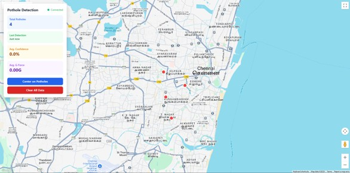
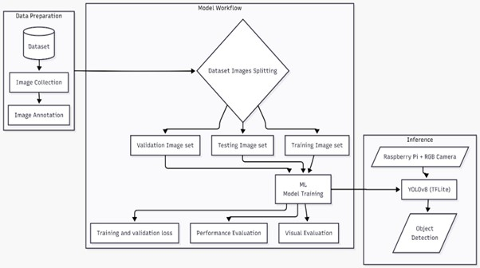

# Road Defect Detection & Monitoring System

> Final year project — An IoT-Enabled Machine Learning Framework for Real-Time Road Defect Detection using YOLOv8 on Raspberry Pi with GPS tagging, IMU validation, Firebase cloud sync, and a live web dashboard.

---

## Demo



---

## System Architecture



```
Camera Video Feed
      ↓
YOLOv8 / TFLite Inference
      ↓
IMU Impact Validation (MPU6050)
      ↓
GPS Coordinate Capture
      ↓
Firebase Firestore Upload
      ↓
Real-Time Dashboard Visualization
```

---

## Project Structure

```
Road-defect-detection/
│
├── README.md
├── requirements.txt
├── .gitignore
│
├── src/
│   ├── train.py              # YOLOv8 model training
│   ├── export.py             # Export trained model to ONNX
│   ├── convert_model.py      # Convert to TFLite (float16 / float32)
│   ├── main_app.py           # Raspberry Pi live detection pipeline
│   ├── vid_process.py        # Optimized video frame processing
│   └── test_feeder.py        # Fake data simulator for dashboard testing
│
├── app/
│   ├── dashboard.html        # Live pothole map dashboard
│   └── application.html      # Browser-based video review (ONNX inference)
│
├── model/
│   └── yolov8n_train/
│       └── weights/
│           ├── best.pt               # Trained YOLOv8 weights
│           ├── best.onnx             # ONNX export (browser inference)
│           ├── best_float16.tflite   # TFLite optimized (Raspberry Pi)
│           └── best_float32.tflite   # TFLite full precision
│
├── results/
│   ├── F1_curve.png
│   ├── P_curve.png
│   ├── PR_curve.png
│   ├── R_curve.png
│   ├── confusion_matrix.png
│   ├── confusion_matrix_normalized.png
│   ├── results.csv
│   ├── results.png
│   ├── labels.jpg
│   ├── labels_correlogram.jpg
│   ├── train_batch*.jpg
│   └── val_batch*_labels/pred.jpg
│
└── docs/
    └── Architecture.png
```

---

## Tech Stack

| Layer | Technology |
|---|---|
| Object Detection | YOLOv8 (Ultralytics) |
| Edge Inference | TensorFlow Lite (float16) |
| Browser Inference | ONNX Runtime |
| Embedded Hardware | Raspberry Pi 4 + MPU6050 + GPS Module |
| Cloud Backend | Firebase Firestore |
| Dashboard | HTML, Tailwind CSS, Google Maps API, Leaflet.js |
| CV / ML Libraries | OpenCV, NumPy, PyTorch |

---

## Getting Started

### Prerequisites

- Python 3.9+
- Raspberry Pi 4 with camera and MPU6050 IMU
- Firebase project with Firestore enabled

### Installation

```bash
git clone https://github.com/VKumar005/Road-defect-detection.git
cd Road-defect-detection
pip install -r requirements.txt
```

---

## Model Training

Fine-tunes YOLOv8n on a custom pothole dataset.

```bash
python src/train.py
```

| Parameter | Value |
|---|---|
| Base Model | YOLOv8n |
| Epochs | 100 |
| Image Size | 640 |
| Framework | Ultralytics YOLO |

Training artifacts are saved to `results/`.

---

## Model Export

### Export to ONNX (for browser-side inference)

```bash
python src/export.py
```

### Export to TFLite (for Raspberry Pi)

```bash
python src/convert_model.py
```

Generates `best_float16.tflite` and `best_float32.tflite` under `model/yolov8n_train/weights/`.

---

## Raspberry Pi Deployment

### Hardware Required

- Raspberry Pi 4
- Pi Camera or USB Camera
- MPU6050 Accelerometer / Gyroscope
- GPS Module
- MicroSD Card (16GB+)
- Power Bank / 5V Supply

### Setup

```bash
sudo apt update && sudo apt install python3-pip -y
python3 -m venv pi_env
source pi_env/bin/activate
pip install opencv-python numpy firebase-admin pyserial mpu6050-raspberrypi tflite-runtime
```

### Run Live Detection

```bash
python src/main_app.py
```

The pipeline continuously:
1. Captures frames from the camera
2. Runs TFLite inference for pothole detection
3. Validates impact using MPU6050 IMU (g-force threshold)
4. Reads GPS coordinates
5. Uploads confirmed detections to Firebase Firestore

Frame skipping is used for better FPS on constrained hardware (`vid_process.py`).

---

## Firebase Integration

Firestore collection path:

```
artifacts/potholedetect-bb0a9/public/data/potholes
```

Each uploaded document contains:

```json
{
  "latitude": 13.0827,
  "longitude": 80.2707,
  "timestamp": "2026-01-01T10:00:00",
  "confidence": 0.95,
  "g_force": 1.8
}
```

> ⚠️ Keep `serviceAccountKey.json` out of version control — it is included in `.gitignore`.

---

## Dashboard

Open `app/dashboard.html` in a browser (or serve locally).

```bash
python -m http.server 8080
# Visit http://localhost:8080/app/dashboard.html
```

Features:
- Live pothole markers on Google Maps / Leaflet fallback
- Real-time Firestore listener
- Pothole count statistics
- Center map, clear data, and connection status controls

---

## Video Frame Review

Open `app/application.html` to review recorded footage.

- Upload a video file
- Runs ONNX inference directly in the browser
- Extracts and displays pothole frames with bounding boxes
- Filter artifacts and export frames as a ZIP

---

## Dashboard Testing (Simulation)

To test the dashboard without hardware, simulate live pothole uploads:

```bash
python src/test_feeder.py
```

Uploads randomized GPS-tagged pothole data to Firestore every 5 seconds along a route between Pachaiyappa's College and Egmore.

---

## Training Results

> *Fill in your actual values from `results/results.csv`.*

| Metric | Value |
|---|---|
| Model | YOLOv8n |
| mAP50 | — |
| Precision | — |
| Recall | — |

Full curves and visualizations are in `results/`.

---
 
## Contributors
 
| Name | GitHub |
|---|---|
| Venkatesan Kumar | [@VKumar005](https://github.com/VKumar005) |
| Vaibhav Ramesh |
| Ramanathan E |


---

## Future Improvements

- Severity estimation per pothole
- Lane-wise defect classification
- Mobile app integration
- Edge TPU acceleration (Coral)
- Automated municipal alert system
- Multi-defect classification (cracks, patches, etc.)

---

## License

Academic / research use only.
